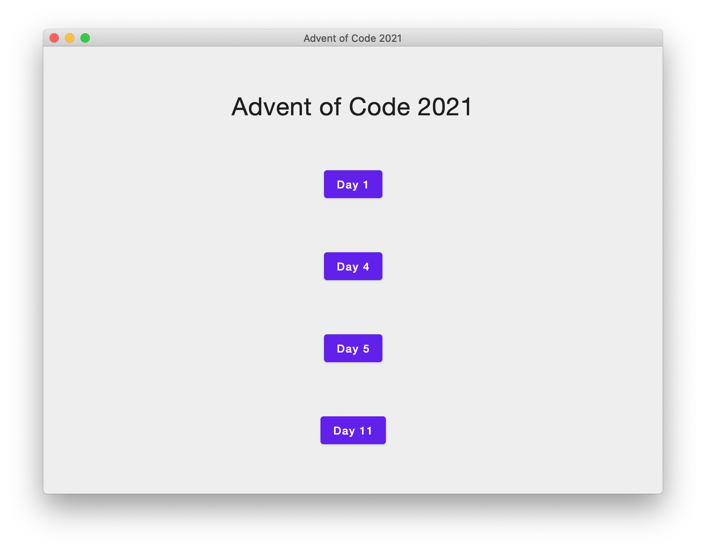

# [Advent of Code 2021][aoc] - [Kotlin][kotlin] + [Compose Multiplatform][compose]

This is my attempt to do some of the [Advent of Code 2021][aoc] puzzles in [Kotlin][kotlin] using the
[Compose Multiplatform][compose] GUI toolkit.

Don't expect to see either good Kotlin or good Compose code - I'm brand new to both.  Each day's code does successfully
solve the puzzle, though.  I'm hoping that Compose will turn out to be a productive and pleasant way to build some GUI
projects I've been thinking of.

I'm getting a bit better as I go along, so you may see major differences between different days.

If you don't care to download the code, here's a few screenshots:

## Main menu

## Day 1

## Day 4

## Day 5

## Day 11

[aoc]: https://adventofcode.com/2021
[kotlin]: https://kotlinlang.org
[compose]: https://www.jetbrains.com/lp/compose-mpp/
